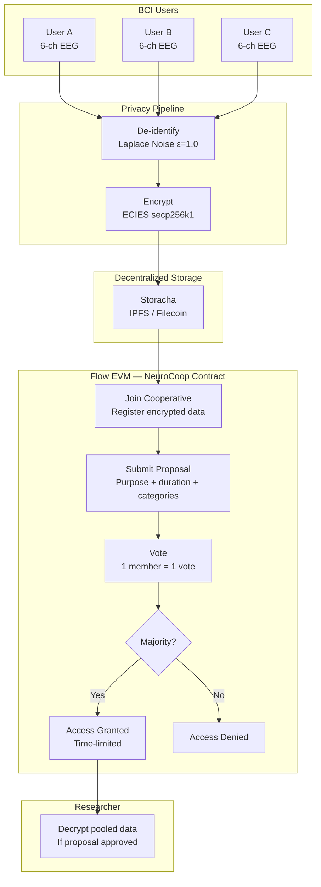
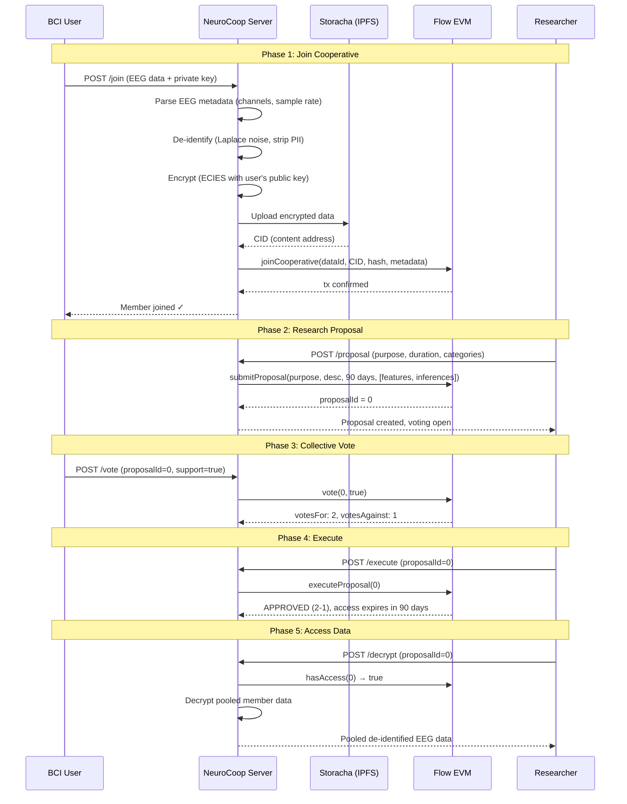

# NeuroCoop — Neural Data Cooperative Protocol

> Collective governance of neural data. Members pool de-identified EEG data, researchers propose studies, and the cooperative votes on access. Built on Flow EVM + Storacha.

**Track:** PL Genesis — Neurotech (Cognition × Coordination × Computation)

**Live:** `http://localhost:3000` (after deployment)

**Contract:** Flow EVM Testnet (Chain ID 545)

---

## The Problem

Individual consent doesn't work for neural data research.

- A single person's EEG has limited research value. Studies need hundreds of subjects.
- Current model: corporations collect neural data with one-time "I agree" consent. Users lose control permanently.
- UNESCO's 2025 Recommendation on Neurotechnology Ethics acknowledged that **"consent-based frameworks may prove insufficient"** when users cannot comprehend what inferences are possible from their neural data.
- As consumer BCI devices enter the market (Emotiv, Muse, Neurable), **16 U.S. states** are now advancing neural data legislation because the existing framework is broken.

The gap: there is no mechanism for BCI users to **collectively** govern their neural data — to decide together which research is acceptable, under what conditions, for how long.

## The Solution

**NeuroCoop** is a data cooperative protocol for neural data. Instead of individual consent managed by corporations, BCI users form a cooperative and govern data access collectively.

```
Individual consent:    User → Corporation → Researcher (user loses control)
NeuroCoop:             Users → Cooperative → Vote → Researcher (users retain control)
```

**Key design principle:** One member, one vote — cognitive equality. No wealth-weighted governance. Your brain data doesn't get more say because you hold more tokens.

---

## Architecture



## Data Flow (Detailed)



## How It Works

### 1. Join the Cooperative

BCI users upload their EEG data. Before storage, the data passes through a privacy pipeline:

- **De-identification**: PII columns stripped, timestamps converted to relative offsets
- **Statistical noise injection**: Laplace noise added (configurable ε parameter) to hinder re-identification. Note: this is not formal differential privacy — see [SECURITY.md](SECURITY.md) for details on what would be needed
- **Encryption**: ECIES (secp256k1 + AES-256-CBC) — only the owner's private key can decrypt
- **Decentralized storage**: Encrypted data uploaded to Storacha (IPFS/Filecoin)
- **On-chain registration**: Data hash, CID, and EEG metadata registered on Flow EVM

### 2. Propose Research

Researchers submit proposals specifying:
- **Purpose**: What the research is about (e.g., "alzheimers-biomarker-study")
- **Duration**: How long access is needed (1-365 days)
- **Data categories**: Which BCI pipeline stages they need access to:

| Category | Pipeline Stage | Example | Sensitivity |
|----------|---------------|---------|-------------|
| Raw EEG | Sensor acquisition | Full 6-channel traces | Highest |
| Processed Features | Signal processing | Band power, ERPs | Medium |
| ML Inferences | Model output | Seizure detection | Lower |
| Session Metadata | Context | Device info, duration | Lowest |

This granularity matters: California SB 1223 (2024) explicitly excludes **inferred data** from neural data protections. NeuroCoop lets users consent to inferences separately, giving them more control than the law requires.

### 3. Collective Vote

Members vote on proposals. The governance model:

- **One member, one vote** — cognitive equality. No token-weighted governance.
- **Simple majority** — more yes votes than no votes
- **On-chain**: Every vote is a Flow EVM transaction, fully auditable
- **Time-bounded**: Proposals have a voting deadline

### 4. Execute & Access

After voting, anyone can execute the proposal:
- **Approved**: Researcher gets time-limited access to the pooled de-identified data
- **Rejected**: Access denied. The cooperative decided collectively.
- **Expired**: Access automatically revokes after the approved duration

### 5. Consent Receipts

Every approved proposal generates a machine-readable consent receipt (ISO/IEC TS 27560:2023, cooperative extension) stored on Storacha. The receipt includes:
- Governance details (vote tally, mechanism)
- Data categories and access duration
- On-chain proof (transaction hash, Flow EVM explorer link)
- Framework alignment (Neurorights, UNESCO, legislation)

---

## Legal & Ethical Framework

NeuroCoop is grounded in existing legislation and international standards:

| Framework | Year | Relevance |
|-----------|------|-----------|
| **Chile Constitution Art. 19 No. 1** | 2021 | First country to constitutionally protect neurorights. Supreme Court ordered Emotiv to delete neural data. |
| **Colorado HB 24-1058** | Aug 2024 | First U.S. law classifying neural data as "sensitive personal information." Requires explicit consent. |
| **California SB 1223** | Sep 2024 | Adds neural data to CCPA. Explicitly excludes inferred data — our system handles this at the category level. |
| **UNESCO Recommendation** | Nov 2025 | First global normative framework. Warns against workplace neural monitoring. Acknowledges consent may be insufficient. |
| **IEEE P7700** | In development | First standard for consumer neurodevice ethics. Covers safety, agency, surveillance, privacy. |
| **Neurorights Foundation** | Ongoing | Five core rights: Mental Privacy, Personal Identity, Free Will, Fair Access, Protection from Bias. |

### Design Alignment

| Neurorights Principle | NeuroCoop Implementation |
|----------------------|--------------------------|
| **Mental Privacy** | Data encrypted per-member; de-identified before pooling; Laplace noise injection |
| **Free Will** | Consent is collective and revocable; no coercive individual pressure |
| **Fair Access** | One member, one vote — cognitive equality; researchers compete on merit |
| **Personal Identity** | Data categories separate raw signals from inferences; users choose what to share |
| **Protection from Bias** | No token-weighted voting; cooperative principles (ICA, since 1844) |

---

## Tech Stack

| Component | Technology | Purpose |
|-----------|-----------|---------|
| Smart Contract | Solidity on **Flow EVM** Testnet | Cooperative governance, voting, access control |
| Encryption | **eth-crypto** (ECIES: secp256k1 + AES-256-CBC) | Per-member data encryption |
| Storage | **Storacha** (IPFS/Filecoin) | Decentralized encrypted data + consent receipts |
| Server | Fastify + TypeScript | API + dashboard |
| Blockchain Client | viem | Flow EVM interaction |
| Privacy | Laplace noise injection (statistical, not formal DP) | EEG de-identification |

---

## Quick Start

```bash
git clone <repo>
cd neurocoop
npm install

# 1. Deploy NeuroCoop.sol to Flow EVM Testnet via Remix
#    - RPC: https://testnet.evm.nodes.onflow.org
#    - Chain ID: 545
#    - Faucet: https://faucet.flow.com/

# 2. Configure
cp .env.example .env
# Fill: COOP_ADDRESS, OWNER_PRIVATE_KEY

# 3. Run
npm run dev

# 4. Open http://localhost:3000
```

## API Endpoints

| Method | Path | Description |
|--------|------|-------------|
| GET | `/` | Dashboard |
| GET | `/health` | Status + cooperative stats + framework info |
| POST | `/join` | De-identify + encrypt + store + join cooperative |
| POST | `/proposal` | Researcher submits research proposal |
| POST | `/vote` | Member votes on proposal (1 member = 1 vote) |
| POST | `/execute` | Finalize proposal (approve or reject) |
| POST | `/decrypt` | Access pooled data (if proposal approved) |
| GET | `/proposals` | List all proposals |
| GET | `/proposal/:id` | Proposal detail + receipt |
| GET | `/members` | Cooperative members |
| GET | `/events` | Governance event log |

---

## Project Structure

```
neurocoop/
├── contracts/
│   └── NeuroCoop.sol      # Cooperative contract (join, propose, vote, execute)
├── src/
│   ├── index.ts           # Fastify server + API endpoints
│   ├── coop.ts            # Flow EVM client for cooperative operations
│   ├── crypto.ts          # ECIES encryption (verified end-to-end)
│   ├── eeg.ts             # EEG parsing + noise-based de-identification
│   ├── storacha.ts        # Decentralized storage (Storacha/IPFS)
│   ├── receipt.ts         # W3C consent receipts (ISO/IEC TS 27560:2023)
│   ├── dashboard.ts       # Interactive cooperative dashboard
│   ├── config.ts          # Configuration + contract ABI
│   └── types.ts           # TypeScript types + enums
├── sample-data/
│   └── sample-eeg.csv     # 6-channel EEG sample (250Hz, 4 neural states)
├── package.json
├── tsconfig.json
├── vitest.config.ts
├── SECURITY.md           # Honest security & limitations documentation
└── README.md
```

## Production Considerations

This is a hackathon prototype. See [SECURITY.md](SECURITY.md) for a detailed analysis of all known limitations. Production deployment would require:

- **Threshold encryption** (e.g., Shamir's Secret Sharing or proxy re-encryption via Umbral) to eliminate server-side key custody
- **Persistent storage** (SQLite or PostgreSQL) for encrypted data cache
- **Wallet-based auth** (MetaMask/WalletConnect) instead of private keys in API requests
- **Formal governance** (quorum requirements, proposal amendment, delegation)
- **Multi-chain** deployment for different BCI device ecosystems
- **Audit** of smart contract by a security firm

---

## Why This Matters

Brain-computer interfaces are moving from lab to market. Consumer EEG devices are already in use for meditation, focus tracking, and gaming. The neural data they generate is uniquely sensitive — it can reveal cognitive states, emotional patterns, and neurological conditions.

The current paradigm — corporate data collection with individual "I agree" consent — has failed for social media data. It will fail worse for neural data, where the stakes are cognitive sovereignty itself.

Data cooperatives offer a different model: collective ownership, democratic governance, and transparent rules. NeuroCoop is a prototype of that future.

---

*Built for PL Genesis: Frontiers of Collaboration — Neurotech Track*

*Aligned with the Neurorights Foundation, UNESCO 2025, Chile 2021, Colorado HB 24-1058, California SB 1223, IEEE P7700*
