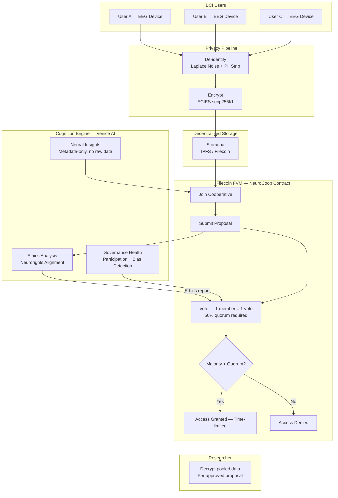

# NeuroCoop — Neural Data Cooperative Protocol

    

> **Collective governance of neural data. BCI users pool de-identified EEG data, vote on research access proposals, and receive AI-assisted governance intelligence — all without surrendering individual control.**

**Track:** PL Genesis — NeuroTech (Cognition × Coordination × Computation)

**Live demo:** [neurocoop-production.up.railway.app](https://neurocoop-production.up.railway.app) — open the dashboard and click "Run Band Power Analysis" or "AI Screen" on any proposal, no setup needed
**Full lifecycle demo:** `POST https://neurocoop-production.up.railway.app/demo/run` — runs join → propose → AI ethics → vote → execute against the live contract in one request
**Contract:** `0x95cdb710677d855159b77e81d6d386ae83f05dab` on [Filecoin Calibration](https://calibration.filfox.info/en/address/0x95cdb710677d855159b77e81d6d386ae83f05dab) (Chain ID 314159, block 3589831)
**Storage:** Storacha (IPFS/Filecoin) — primary data layer, multi-gateway retrieval with hash verification
**Repo:** [github.com/geeythree/NeuroCoop](https://github.com/geeythree/NeuroCoop)

---

## The Problem

Individual consent is broken for neural data.

- **Scale problem:** A single person's EEG has limited research value. Studies need hundreds of subjects. Individual consent can't aggregate.
- **Comprehension problem:** UNESCO's 2025 Recommendation on Neurotechnology Ethics acknowledged that *"consent-based frameworks may prove insufficient"* when users cannot comprehend what inferences are possible from their neural data.
- **Control problem:** Current model — corporations collect neural data with one-time "I agree" consent. Users lose control permanently.
- **Legislation gap:** 16 U.S. states are advancing neural data legislation precisely because the existing framework is failing. Colorado HB 24-1058, California SB 1223, Chile's constitutional protections — all responding to a gap that individual consent cannot fill.

**The result:** As consumer BCI devices enter the market (Emotiv, Muse, Neurable), we are building the same data power asymmetry that destroyed social media privacy, but for brain data.

## The Solution

**NeuroCoop** is a neural data cooperative protocol. BCI users form a cooperative, pool their de-identified EEG data, and govern research access collectively. Before members vote, an AI Cognition Engine (Venice AI, zero data retention) analyzes proposals for ethical risks that non-expert members might miss.

```
BEFORE NeuroCoop:
  User ──→ Corporation ──→ Researcher
  (user loses control at step 1)

WITH NeuroCoop:
  Users ──→ Cooperative ──→ [AI Ethics Analysis] ──→ Democratic Vote ──→ Researcher
  (users govern collectively; AI informs, humans decide)
```

## What Makes This Novel

No existing system combines all of these:

| What | Why it matters |
|------|---------------|
| **Cooperative governance on-chain** | Consent is a collective act, not individual — enforced by smart contract, not a checkbox |
| **AI ethics pre-screening before every vote** | Members who aren't neuroscientists can evaluate proposals they'd otherwise rubber-stamp or blindly reject |
| **Predatory proposal detection** | The dashboard ships with a deliberately bad proposal pre-filled ("cognitive profiling for ad targeting") — run AI ethics on it and watch it get flagged. This is the design working as intended. |
| **W3C UCAN delegations as consent proofs** | When a proposal executes, the researcher receives a cryptographically signed, time-bounded capability proof from the cooperative's Storacha space — not an API key, a verifiable credential |
| **ISO/IEC TS 27560:2023 consent receipts** | Every approved proposal generates a portable consent receipt anchored to a Filecoin transaction hash — auditable by regulators, portable across systems |
| **Real clinical EEG from PhysioNet** | 64-channel, 160Hz EEG from EEGMMIDB (CC0) — not synthetic data |
| **Band power extracted in-process** | Delta/theta/alpha/beta/gamma computed locally via multi-scale successive difference analysis — no API call, no data leaving the server |

**Three pillars of the NeuroTech track, all addressed:**

| Pillar | Implementation |
|--------|---------------|
| **Cognition** | Venice AI analyzes proposals for Neurorights alignment, flags risks, detects predatory research framing — helping members with no neuroscience background make informed decisions |
| **Coordination** | On-chain one-member-one-vote governance (cognitive equality — no token weighting), 50% quorum requirement, time-bounded voting, W3C consent receipts |
| **Computation** | EEG de-identification pipeline (Laplace noise + PII removal + timestamp anonymization), ECIES secp256k1 encryption, Storacha decentralized storage |

---

## Architecture



---

## Cognition Engine — AI-Assisted Governance

The Cognition Engine is the core innovation of NeuroCoop. It addresses a fundamental problem in neural data governance: **most cooperative members are not neuroscientists or lawyers.** They cannot evaluate whether a proposal requesting "motor imagery classification for BCI control" is legitimate research or a cover for covert cognitive profiling.

The Cognition Engine operates at two levels:

**Local signal processing (no external API):** `POST /cognition/eeg-bands` runs multi-scale successive difference analysis directly on EEG samples to extract delta/theta/alpha/beta/gamma band power — real neuroscience computation that runs in-process.

**AI-assisted governance (Venice AI, zero data retention):** Three endpoints that process only anonymized metadata and proposal descriptions — raw neural signals never leave the server.

### 0. EEG Band Power — `POST /cognition/eeg-bands`

Real signal processing. No API call. Runs locally in-process:

```bash
curl -X POST https://neurocoop-production.up.railway.app/cognition/eeg-bands \
  -H "Content-Type: application/json" \
  -d '{}'
```

Response:
```json
{
  "bandPower": {
    "absoluteUvRms": {
      "delta": 142.3, "theta": 89.1, "alpha": 201.4, "beta": 178.6, "gamma": 94.2
    },
    "relativePowerPercent": {
      "delta": 20, "theta": 13, "alpha": 29, "beta": 25, "gamma": 13
    },
    "dominantBand": "alpha",
    "interpretation": "Dominant alpha activity — hallmark of relaxed wakefulness (eyes-closed rest). Strong alpha suppression during active tasks."
  },
  "metadata": { "sampleRate": 160, "channelsAnalysed": 64, "sampleCount": 9600 },
  "source": "edf:64ch/160Hz/60s (PhysioNet EEGMMIDB, CC0)",
  "method": "Multi-scale successive difference analysis (RMS of x[t]-x[t-s], no external API)"
}
```

### 1. Ethics Analysis — `POST /cognition/analyze-proposal`

Before voting opens on a proposal, members can request an AI ethics review:

```json
{
  "proposalId": 0
}
```

Response:
```json
{
  "analysis": {
    "ethicsScore": 87,
    "riskLevel": "low",
    "recommendation": "approve",
    "reasoning": "Alzheimer's biomarker research with appropriate duration and category scope. No surveillance indicators detected.",
    "concerns": [],
    "strengths": ["Clear scientific purpose", "Limited duration (90 days)", "Appropriate data categories"],
    "alignmentScore": {
      "neurorights": 90,
      "mentalPrivacy": 85,
      "freeWill": 88,
      "fairAccess": 87,
      "protectionFromBias": 85
    },
    "redFlags": []
  }
}
```

The AI does not vote. The cooperative does. AI informs; humans decide.

### 2. Neural Insights — `POST /cognition/neural-insights`

Help members understand what their EEG data reveals **before** they join the cooperative:

```json
{
  "insights": {
    "patterns": ["Resting-state neural oscillations (alpha/beta bands)", "4 labeled cognitive states"],
    "sensitivityLevel": "high",
    "cognitiveStatesDetected": ["focused", "relaxed", "drowsy", "neutral"],
    "privacyRisk": "Labeled EEG with cognitive states can reveal attention disorders and mental health conditions."
  }
}
```

Raw neural signals are **never sent to the AI** — only anonymized statistical metadata.

### 3. Governance Health — `GET /cognition/governance-health`

Live AI assessment of the cooperative's democratic health. Venice AI analyses participation rates, concentration risk, and approval bias — flagging governance problems that members might not notice themselves.

**Live output from the deployed cooperative (5 members, 8 proposals):**

```json
{
  "cooperative": { "memberCount": 5, "proposalCount": 8, "approvedCount": 1, "rejectedCount": 0 },
  "health": {
    "healthScore": 20,
    "participationRate": 15,
    "concentrationRisk": "High risk due to low average votes per proposal, indicating potential for single-member dominance",
    "approvalBias": "Suspiciously low, may indicate lack of confidence in proposals or ineffective proposal process",
    "recommendations": [
      "Increase member engagement through regular meetings and clear proposal communication",
      "Review and refine proposal submission and voting processes"
    ],
    "warnings": [
      "Low participation rate may lead to plutocracy drift",
      "Lack of rejected proposals may indicate rubber-stamping or lack of diverse perspectives"
    ]
  },
  "model": "llama-3.3-70b (Venice AI — zero data retention)"
}
```

This is the Cognition Engine doing its job: detecting governance risks on real on-chain data, not synthetic examples. The low participation warning is correct — the cooperative needs more engaged voters, and Venice AI is the one raising the alarm.

---

## How It Works

### 1. Register Wallet (one-time)

```bash
curl -X POST https://neurocoop-production.up.railway.app/wallet/register \
  -H "Content-Type: application/json" \
  -d '{ "privateKey": "0x..." }'
# Returns: { "address": "0x...", "message": "Wallet registered. Use nonce auth for all future calls." }
```

### 2. Get Nonce (before each request)

```bash
curl https://neurocoop-production.up.railway.app/auth/nonce/0xYOUR_ADDRESS
# Returns: { "nonce": "abc123...", "message": "NeuroCoop|auth|address:0x...|nonce:abc123|expires:1743..." }
```

### 3. Sign + Use

```javascript
const { message } = await fetch('/auth/nonce/0xYOUR_ADDRESS').then(r => r.json());
const sig = wallet.sign(keccak256(message));

// Now use { address, nonce, signature } instead of { privateKey }
await fetch('/join', {
  method: 'POST',
  body: JSON.stringify({ address: '0x...', nonce: 'abc123...', signature: sig })
});
```

Private keys are **never transmitted after initial registration**.

### 4. Join & Upload EEG Data

The `/join` endpoint accepts an optional `data` field containing raw EEG CSV. If omitted, it automatically uses the bundled PhysioNet EEGMMIDB recording (`S001R01.edf` — 64 channels, 160 Hz, eyes-open resting state, CC0 license) as the default. Every member gets real clinical EEG unless they supply their own.

**Option A — use default PhysioNet data (simplest):**
```bash
curl -X POST https://neurocoop-production.up.railway.app/join \
  -H "Content-Type: application/json" \
  -d '{ "privateKey": "0x..." }'
```

**Option B — bring your own EEG CSV:**
```bash
curl -X POST https://neurocoop-production.up.railway.app/join \
  -H "Content-Type: application/json" \
  -d '{
    "privateKey": "0x...",
    "data": "timestamp,Fp1,Fp2,F3,...\n0,12.3,11.1,...",
    "filename": "my-eeg.csv",
    "deidentify": true,
    "noiseEpsilon": 1.0
  }'
```

**What happens on every join:**
1. EEG de-identified — Laplace noise injection (ε=1.0), PII column removal, timestamps made relative
2. De-identified data encrypted — ECIES secp256k1 + AES-256-CBC (unique ephemeral key per member)
3. Encrypted blob uploaded to Storacha — returns a content-addressed CID
4. `joinCooperative()` called on the Filecoin FVM contract with the CID on-chain

Note: EDF file upload directly via the dashboard UI is not yet supported — EDF is used server-side from bundled sample data only. Direct EDF upload is a planned addition (see ROADMAP.md).

### 5. Submit a Research Proposal

```bash
curl -X POST https://neurocoop-production.up.railway.app/proposal \
  -d '{ "address": "0x...", "nonce": "...", "signature": "...",
        "purpose": "alzheimers-biomarker-detection",
        "description": "...", "durationDays": 90,
        "categories": [1, 2] }'
```

### 6. Get AI Ethics Analysis Before Voting

```bash
curl -X POST https://neurocoop-production.up.railway.app/cognition/analyze-proposal \
  -d '{ "proposalId": 0 }'
```

### 7. Vote

```bash
curl -X POST https://neurocoop-production.up.railway.app/vote \
  -d '{ "address": "0x...", "nonce": "...", "signature": "...", "proposalId": 0, "support": true }'
```

---

## API Reference

| Method | Path | Description |
|--------|------|-------------|
| GET | `/` | Interactive dashboard |
| GET | `/health` | Status, cooperative stats, framework alignment |
| POST | `/wallet/register` | One-time wallet registration |
| GET | `/auth/nonce/:address` | Get signing challenge (5-min TTL) |
| POST | `/join` | De-identify → Encrypt → Store → Join cooperative |
| POST | `/proposal` | Submit research proposal |
| POST | `/vote` | Cast vote (1 member = 1 vote) |
| POST | `/execute` | Finalize proposal after voting period |
| POST | `/decrypt` | Access pooled data — requires challenge signature (see `/challenge/:proposalId`) |
| **POST** | **`/cognition/eeg-bands`** | **EEG band power (delta/theta/alpha/beta/gamma) — local signal processing, no API** |
| **POST** | **`/cognition/analyze-proposal`** | **AI ethics analysis via Venice AI (zero data retention)** |
| **POST** | **`/cognition/neural-insights`** | **What your EEG metadata reveals — AI analysis of anonymized stats only** |
| **GET** | **`/cognition/governance-health`** | **Cooperative governance health score** |
| **GET** | **`/storacha/verify/:cid`** | **Verify a CID is live on IPFS/Filecoin with hash proof** |
| **GET** | **`/storacha/records`** | **All uploaded CIDs with Filecoin gateway URLs** |
| POST | `/expire` | Expire a proposal past its voting deadline (anyone can call) |
| POST | `/storacha/delegate` | Issue a W3C UCAN delegation to an approved researcher |
| POST | `/sign-challenge` | Server-side challenge signing helper for dashboard |
| POST | `/demo/run` | Full lifecycle demo (join → propose → vote → execute) against live contract |
| GET | `/proposals` | List all proposals |
| GET | `/proposal/:id` | Proposal detail + consent receipt |
| GET | `/members` | Cooperative members |
| GET | `/audit` | Persistent audit trail |
| GET | `/challenge/:proposalId` | SIWE-style data access challenge |

---

## UCAN Consent Delegation

When a proposal executes, the approved researcher can call `POST /storacha/delegate` to receive a **W3C UCAN delegation** — a cryptographically signed, time-bounded capability proof issued by the cooperative's Storacha space.

```bash
curl -X POST https://neurocoop-production.up.railway.app/storacha/delegate \
  -H "Content-Type: application/json" \
  -d '{ "proposalId": 0, "researcherDid": "did:key:z6Mk...", "signature": "0x..." }'
```

Response includes:
- `archive` — base64-encoded UCAN CAR file (portable, verifiable credential)
- `delegationCid` — content-addressed CID of the delegation block
- `expiresAt` — matches the on-chain `accessExpiresAt` for the proposal
- `ability` — `upload/add` scoped to the cooperative's space

When the access window closes, the delegation expires. The researcher cannot extend it. Only a new cooperative vote can grant renewed access.

---

## Privacy Model

### What NeuroCoop does

| Layer | Technique | Guarantee |
|-------|-----------|-----------|
| De-identification | Laplace noise (ε=1.0), PII removal, relative timestamps | Makes exact value recovery harder |
| Encryption | ECIES secp256k1 + AES-256-CBC (eth-crypto) | Only key holder can decrypt |
| Storage | Storacha (IPFS/Filecoin) | Decentralized, content-addressed |
| AI processing | Venice AI, metadata only | Zero data retention, no raw signals |
| Auth | Nonce-based signature verification | Private keys never transmitted after registration |

### What NeuroCoop does NOT (honestly documented)

- **Custodial key model:** Wallets are registered once and stored server-side in SQLite. Nonce auth proves *who is calling*, not that keys stay off-server. This is a custodial demo. Production requires non-custodial signing (MetaMask/WalletConnect) where the server never sees private keys.
- **Not formal differential privacy:** Laplace noise without sensitivity calibration or privacy budget tracking. True DP would require per-query sensitivity analysis and composition theorem application.
- **Not threshold encryption:** Server holds decryption keys for pooled data access. Production would require Shamir's Secret Sharing or proxy re-encryption (Umbral/NuCypher).
- **Not end-to-end:** Server decrypts and re-encrypts for approved researchers. TEE (Trusted Execution Environment) would eliminate server trust.
- **No right to deletion:** IPFS is content-addressed and immutable. Revoking CID access is possible; true deletion is not.

See [SECURITY.md](SECURITY.md) for full analysis.

### Roadmap (upcoming additions)

Planned work toward production—non-custodial wallets, stronger cryptography, formal privacy, audited contracts, and operability—is summarized in [ROADMAP.md](ROADMAP.md).

---

## Legal & Ethical Framework

| Framework | Relevance | NeuroCoop Response |
|-----------|-----------|-------------------|
| **Chile Constitution Art. 19** (2021) | First constitutional neurorights protection | Cooperative governance model gives users collective control |
| **Colorado HB 24-1058** (Aug 2024) | Neural data as sensitive personal information | Explicit consent receipts (ISO/IEC TS 27560:2023) per approved proposal |
| **California SB 1223** (Sep 2024) | CCPA extension to neural data; excludes inferences | Separate consent by data category (Raw EEG / Features / Inferences / Metadata) |
| **UNESCO Recommendation** (Nov 2025) | First global normative framework; consent may be insufficient | Collective governance addresses the insufficiency directly |
| **IEEE P7700** (in development) | Consumer neurodevice ethics standard | AI ethics analysis aligns with P7700 risk categories |
| **Neurorights Foundation** | Five rights: Mental Privacy, Identity, Free Will, Fair Access, Bias Protection | Venice AI scores proposals against all five rights |

---

## Smart Contract

`NeuroCoop.sol` — deployed on Filecoin Calibration (Chain ID 314159)

```solidity
// Key governance properties:
uint256 public constant QUORUM_BPS = 5000;  // 50% quorum required
uint256 public votingPeriod = 86400;         // 1 day default (configurable)
uint256 public activeProposalCount;          // O(1) tracking — no O(n) scans

// One member, one vote — no token weighting
function vote(uint256 proposalId, bool support) external onlyMember

// O(1) leave — safe at scale
function leaveCooperative() external onlyMember nonReentrant

// Anyone can expire a dead proposal to maintain accurate activeProposalCount
function expireProposal(uint256 proposalId) external nonReentrant
```

**Security properties:**
- ReentrancyGuard on all state-changing functions
- 50% quorum enforced on-chain (cannot be bypassed by server)
- Duplicate data hash prevention
- Time-bounded access (expires on-chain, not server-side)
- O(1) `activeProposalCount` tracking (no gas-bomb O(n) loops)

---

## Tech Stack

| Component | Technology | Purpose |
|-----------|-----------|---------|
| Smart Contract | Solidity on **Filecoin Calibration (FVM)** | Cooperative governance, voting, access control — Protocol Labs native chain |
| Storage (primary) | **Storacha** (IPFS/Filecoin) | Encrypted data + consent receipts — multi-gateway retrieval with hash verification |
| Storage (fallback) | **SQLite** (better-sqlite3) | Local cache when IPFS gateways unreachable |
| Signal Processing | **Multi-scale band power** (local, no API) | Delta/theta/alpha/beta/gamma extraction from raw EEG |
| AI / Ethics | **Venice AI** (llama-3.3-70b, zero data retention) | Proposal ethics analysis, governance health |
| Encryption | **eth-crypto** (ECIES secp256k1 + AES-256-CBC) | Per-member data encryption |
| Server | **Fastify** + TypeScript | API + dashboard |
| Auth | Nonce-based signature verification | Private keys never transmitted after registration |
| Blockchain Client | **viem** | Filecoin FVM interaction |

---

## Quick Start (Local)

```bash
git clone https://github.com/geeythree/NeuroCoop.git
cd NeuroCoop
npm install

# 1. Deploy NeuroCoop.sol to Filecoin Calibration (FVM) via Remix
#    - Network: Filecoin Calibration (Chain ID 314159)
#    - RPC: https://api.calibration.node.glif.io/rpc/v1
#    - Explorer: https://calibration.filfox.info
#    - Faucet: https://faucet.calibnet.chainsafe-fil.io/

# 2. Configure
cp .env.example .env
# Fill: COOP_ADDRESS, OWNER_PRIVATE_KEY, VENICE_API_KEY, STORACHA_EMAIL

# 3. Run
npm run dev

# 4. Register wallet (one-time)
curl -X POST http://localhost:3000/wallet/register \
  -H "Content-Type: application/json" \
  -d '{"privateKey": "0x..."}'

# 5. Try the Cognition Engine
curl -X POST http://localhost:3000/cognition/neural-insights \
  -H "Content-Type: application/json" \
  -d '{}'
```

## Deploy to Railway

```bash
# Install Railway CLI
npm i -g @railway/cli

# Login and deploy
railway login
railway init
railway up

# Set environment variables:
railway variables --set "COOP_ADDRESS=0x..."
railway variables --set "OWNER_PRIVATE_KEY=0x..."
railway variables --set "VENICE_API_KEY=..."
railway variables --set "STORACHA_EMAIL=..."
railway variables --set "STORACHA_KEY=..."     # from: npx @storacha/cli key create
railway variables --set "STORACHA_PROOF=..."   # from: npx @storacha/cli delegation create <server-did> --can 'upload/add' --base64
```

---

## Why This Matters

Brain-computer interfaces are moving from lab to consumer market. The neural data they generate is qualitatively different from any prior form of personal data — it can reveal cognitive states, emotional patterns, attention disorders, and neurological conditions that users may not even be aware of themselves.

The current paradigm — corporate data collection with individual "I agree" consent — failed for social media. It will fail catastrophically for neural data, where the stakes are cognitive sovereignty itself.

Data cooperatives offer a structurally different model: collective ownership, democratic governance, and transparent rules enforced on-chain. NeuroCoop adds an AI layer that helps non-expert members make informed decisions about proposals they lack the technical background to evaluate alone.

**The cooperative vote is always the binding decision. The AI informs. The humans decide.**

---

## Project Structure

```
neurocoop/
├── contracts/
│   └── NeuroCoop.sol          # Cooperative contract (join, propose, vote, execute, expire)
├── src/
│   ├── index.ts               # Fastify server + API endpoints
│   ├── cognition.ts           # Venice AI — ethics analysis, neural insights, governance health
│   ├── coop.ts                # Filecoin FVM client for cooperative operations
│   ├── crypto.ts              # ECIES encryption + nonce-based auth
│   ├── eeg.ts                 # EEG parsing + noise-based de-identification
│   ├── storacha.ts            # Decentralized storage (Storacha/IPFS)
│   ├── receipt.ts             # W3C consent receipts (ISO/IEC TS 27560:2023)
│   ├── db.ts                  # SQLite persistence (uploads, wallets, receipts, audit)
│   ├── dashboard.ts           # Interactive cooperative dashboard
│   ├── config.ts              # Configuration + contract ABI
│   └── types.ts               # TypeScript types + enums
├── sample-data/
│   ├── S001R01.edf            # PhysioNet EEGMMIDB — 64ch, 160Hz, eyes-open resting state (CC0)
│   ├── S001R02.edf            # PhysioNet EEGMMIDB — 64ch, 160Hz, eyes-closed resting state (CC0)
│   ├── S002R01.edf            # PhysioNet EEGMMIDB — 64ch, 160Hz, subject 2 resting state (CC0)
│   └── sample-eeg.csv         # 6-channel synthetic EEG sample (250Hz, 4 cognitive states, CSV fallback)
├── railway.json               # Railway deployment config
├── nixpacks.toml              # Build config
├── SECURITY.md                # Honest security & limitations documentation
├── ROADMAP.md                 # Upcoming additions toward production readiness
└── README.md
```

---

*Built for PL Genesis: Frontiers of Collaboration — NeuroTech Track (Cognition × Coordination × Computation)*

*Aligned with: Neurorights Foundation · UNESCO 2025 · Chile Constitution 2021 · Colorado HB 24-1058 · California SB 1223 · IEEE P7700*
